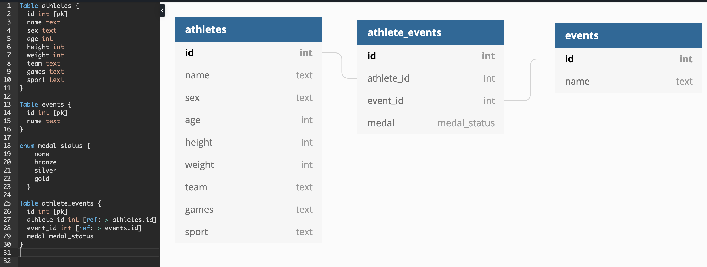

## README

# Olympians API

## Turing School Project
[Original Project Description](https://github.com/turingschool/backend-curriculum-site/blob/gh-pages/module4/projects/take_home_challenge/prompts/olympic_spec.md)

### Core Contributors:
[Jeremy Bennett](https://github.com/JaxJafinPapau)

#### How to Contribute
Please follow the [Initial Setup](#initial-setup) guide and then submit a pull request.


## Introduction

Welcome to the Olympians API, an individual project for Module 4 at Turing School of Software and Design. This RESTful API built in Rails 5.2 produces [end points](#End_Points) that give statistical information about the 2016 Olympic Games.


## Initial Setup

To run on your local machine, please FORK then clone this repository.
Please ensure you have the latest version of Ruby on Rails found [here](https://guides.rubyonrails.org/getting_started.html).
In a unix terminal, from the directory into which you cloned this repo, you may then run the commands:

`bundle install`;
`rails db:schema:load`;
`rails import_from_csv:all_data`;
`rails s`;

Then use postman or a browser to visit the API endpoints as listed below. The default development environment runs on:

`localhost:3000/`

## End Points

All endpoints hosted at [https://stormy-savannah-15965.herokuapp.com/api/v1/](https://stormy-savannah-15965.herokuapp.com/api/v1/).  

A sample request might be `GET https://stormy-savannah-15965.herokuapp.com/api/v1/events`

#### Olympians

**`GET /api/v1/olympians`**:  

Upon success:  
Status -- 200

```
{
    "olympians": [
        {
            "id": 790,
            "name": "Saskia Bartusiak",
            "team": "Germany",
            "age": 33,
            "sport": "Football",
            "total_medals_won": 1
        },
        {
            "id": 2850,
            "name": "Nelson vora",
            "team": "Portugal",
            "age": 32,
            "sport": "Athletics",
            "total_medals_won": 0
        },
        {
            "id": 1798,
            "name": "James Nyang Chiengjiek",
            "team": "Refugee Olympic Athletes",
            "age": 24,
            "sport": "Athletics",
            "total_medals_won": 0
        }, ...
```


**`GET /api/v1/olympians?age=youngest`**:

You may also substitute `oldest` for `youngest` to find the oldest olympian.

Upon success:  
Status -- 200

```
{
    "olympians": [
        {
            "id": 2190,
            "name": "Ana Iulia Dascl",
            "team": "Romania",
            "age": 13,
            "sport": "Swimming",
            "total_medals_won": null
        }
    ]
}
```

**`GET /api/v1/events`**:  

Upon success:  
Status -- 200

```
{
    "events": [
        {
            "sport": "Weightlifting",
            "events": [
                "Weightlifting Women's Super-Heavyweight",
                "Weightlifting Men's Heavyweight",
                "Weightlifting Men's Middleweight",
                "Weightlifting Men's Middle-Heavyweight",
                "Weightlifting Men's Featherweight",
                "Weightlifting Women's Flyweight",
                "Weightlifting Women's Middleweight",
                "Weightlifting Women's Lightweight",
                "Weightlifting Men's Lightweight",
                "Weightlifting Men's Super-Heavyweight",
                "Weightlifting Men's Light-Heavyweight",
                "Weightlifting Women's Heavyweight",
                "Weightlifting Women's Light-Heavyweight",
                "Weightlifting Men's Bantamweight",
                "Weightlifting Women's Featherweight"
            ]
        },
        {
            "sport": "Gymnastics",
            "events": [
                "Gymnastics Men's Individual All-Around",
                "Gymnastics Men's Floor Exercise",
                "Gymnastics Men's Parallel Bars",
                "Gymnastics Men's Horizontal Bar",
                "Gymnastics Men's Rings",
                "Gymnastics Men's Pommelled Horse",
                "Gymnastics Men's Team All-Around",
                "Gymnastics Men's Horse Vault",
                "Rhythmic Gymnastics Women's Group",
                "Gymnastics Women's Team All-Around",
                "Gymnastics Women's Uneven Bars",
                "Gymnastics Women's Balance Beam",
                "Gymnastics Women's Individual All-Around",
                "Gymnastics Women's Floor Exercise",
                "Rhythmic Gymnastics Women's Individual",
                "Gymnastics Women's Horse Vault"
            ]
        }, ...
```

**`PATCH /api/v1/events/:id/medalists`**:  

Upon Success:
Status -- 200.  

```
{
    "event": "Rowing Men's Coxless Pairs",
    "medalists": [
        {
            "name": "Giovanni Abagnale",
            "team": "Italy",
            "age": 21,
            "medal": "bronze"
        },
        {
            "name": "Hamish Byron Bond",
            "team": "New Zealand",
            "age": 30,
            "medal": "gold"
        },
        {
            "name": "Lawrence Brittain",
            "team": "South Africa",
            "age": 25,
            "medal": "silver"
        }
    ]
}
```  

## Running Tests

The test suite for this project is rspec. In order to run the suite, after following the [initial setup](#initial-setup) instructions above, run the following from a terminal in the root project directory:

`bundle exec rspec`

## Schema Design



## Tech Stack

- Rails 5.2
- Rspec

